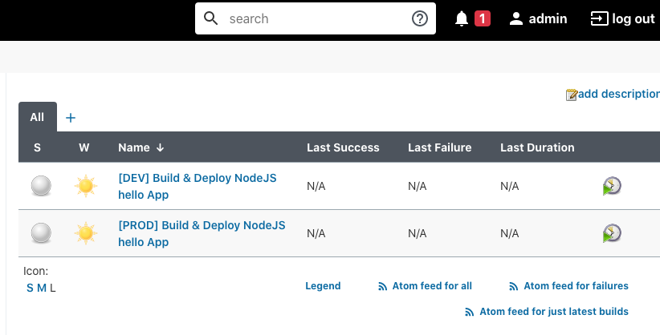
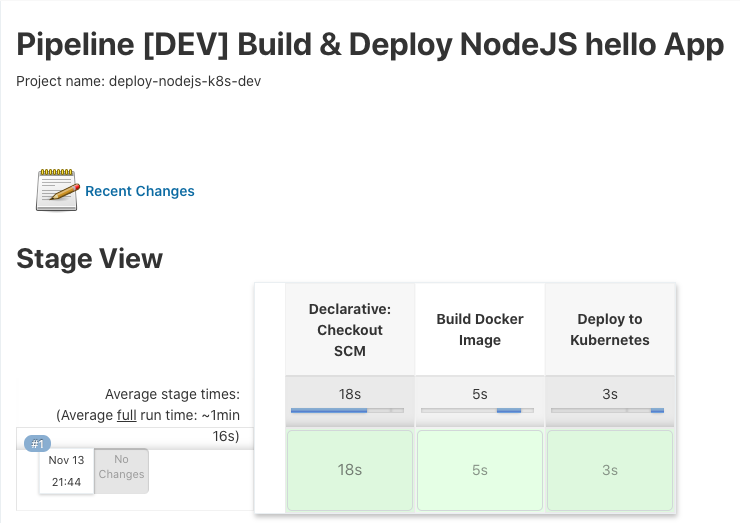

# Automated CI/CD Setup
This guide describes how to setup the infrastructure and use Jenkins to build and deploy the application in an automated manner.

## Create Infrastructure
By running the `setup.sh` script, we create the necessary infrastructure for our application.

The script first installs Jenkins in Minikube. The Jenkins pipelines needed deploying our app are automatically provisioned using configuration-as-code.

The script then installs MySQL to 2 kubernetes namespaces for the  infrastructure environments: `dev` and `prod`.
> Note that the script might take a few minutes to finish because jenkins needs to fetch and install some plugins at startup
```bash
./setup.sh

--------------------------------------------------------------
--------- Adding helm repos
--------------------------------------------------------------

"jenkinsci" has been added to your repositories
"stable" has been added to your repositories
Update Complete. ⎈ Happy Helming!⎈

...
--------------------------------------------------------------
--------- Installing Jenkins CI/CD Helm chart
--------------------------------------------------------------

serviceaccount/jenkins created
clusterrolebinding.rbac.authorization.k8s.io/jenkins created
Release "jenkins" does not exist. Installing it now.
...
--------------------------------------------------------------
--------- Deploying MySQL to dev environment
--------------------------------------------------------------

Release "mysql" does not exist. Installing it now.
NAME: mysql
LAST DEPLOYED: Fri Nov 13 21:15:03 2020
NAMESPACE: dev
...
--------- Deploying MySQL to prod environment
--------------------------------------------------------------

Release "mysql" does not exist. Installing it now.
NAME: mysql
LAST DEPLOYED: Fri Nov 13 21:15:18 2020
NAMESPACE: prod
STATUS: deployed
```
We can check the running pods now to make sure they are running fine:

```bash
kubectl get pods
NAME                       READY   STATUS    RESTARTS   AGE
jenkins-6b9d8d97fb-b2rgx   2/2     Running   0          13m

kubectl get pods --namespace=dev
NAME                    READY   STATUS    RESTARTS   AGE
mysql-67799649d-2swxn   1/1     Running   0          13m

kubectl get pods --namespace=prod
NAME                    READY   STATUS    RESTARTS   AGE
mysql-67799649d-d7gwg   1/1     Running   0          13m
```

## Deploy nodejs-k8s app
### Access Jenkins
Jenkins should be now available under http://jenkins.default.local.

We can check that using the following `kubectl` command:
```bash
kubectl get ing
NAME      CLASS    HOSTS                   ADDRESS        PORTS   AGE
jenkins   <none>   jenkins.default.local   192.168.64.2   80      **12h**
```
Let's navigate to https://jenkins.default.local using the web browser, the admin login credentials can be found in [`values/jenkins.yaml`](../values/jenkins.yaml)
```
  adminUser: admin
  adminPassword: admin
```
After the login, we should see 2 Jenkins pipeline jobs: one for `dev` and one for `prod`:



The `dev` pipeline fetches code from the `develop` branch of the repository, while the `prod` pipeline fetches code from the `main` branch.

### Deploy app
In order to deploy the nodejs-k8s app to the `dev` or `prod` environments, we only need to trigger the corresponding Jenkins pipeline which performs the following steps:
1. Fetch the code from github
2. Build a new Docker image
3. Deploy the nodejs-k8s app to the corresponding environment

The dev pipeline as an example:



### Access the app
Once the build is finished, we can check that our application is up and running with `kubectl`
```bash
kubectl get deployments.apps -n dev nodejs-k8s
NAME         READY   UP-TO-DATE   AVAILABLE   AGE
nodejs-k8s   1/1     1            1           4m47s
kubectl get ing -n dev
NAME         CLASS    HOSTS             ADDRESS        PORTS   AGE
nodejs-k8s   <none>   hello.dev.local   192.168.64.2   80      5m38s
```
As indicated by the ingress object, our application is now finally accessible at http://hello.dev.local.

> [Return to README.md](../README.md)
